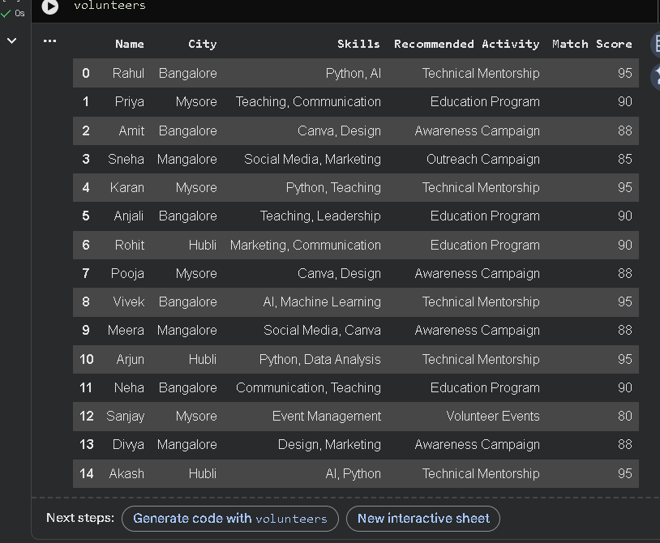
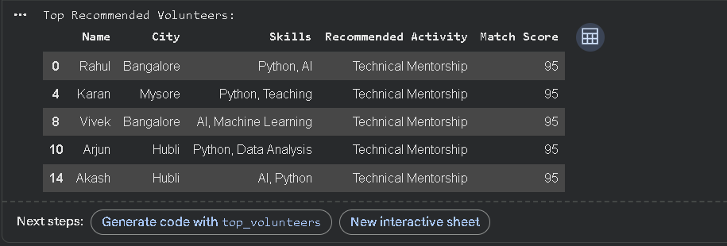
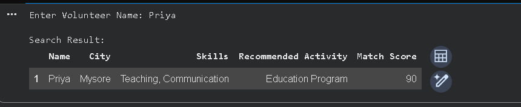
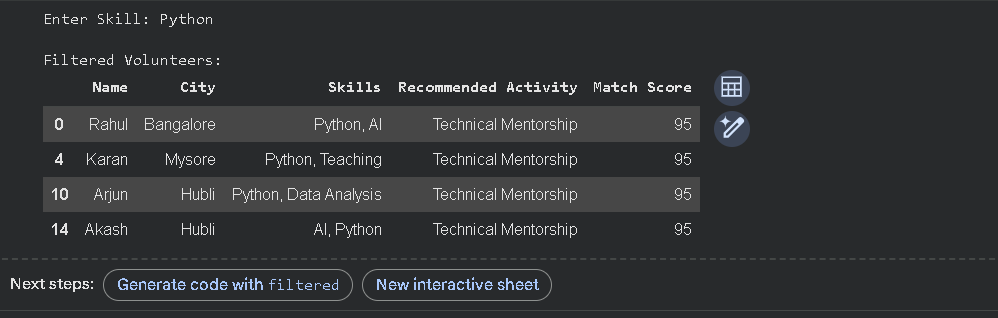
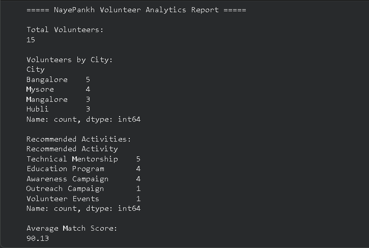
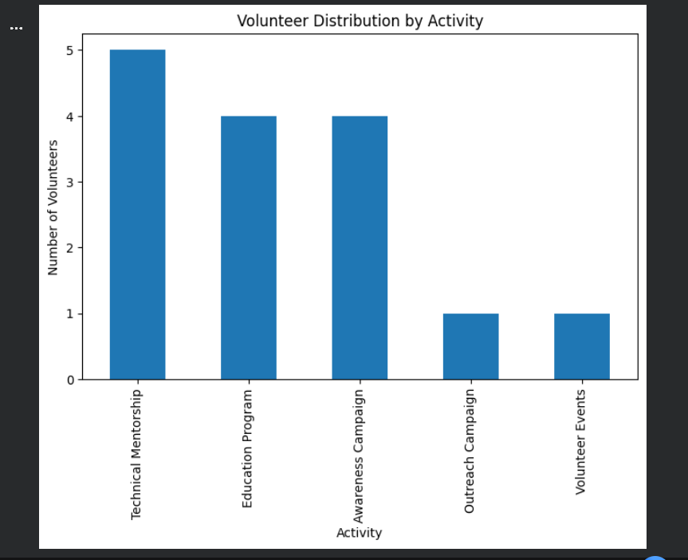
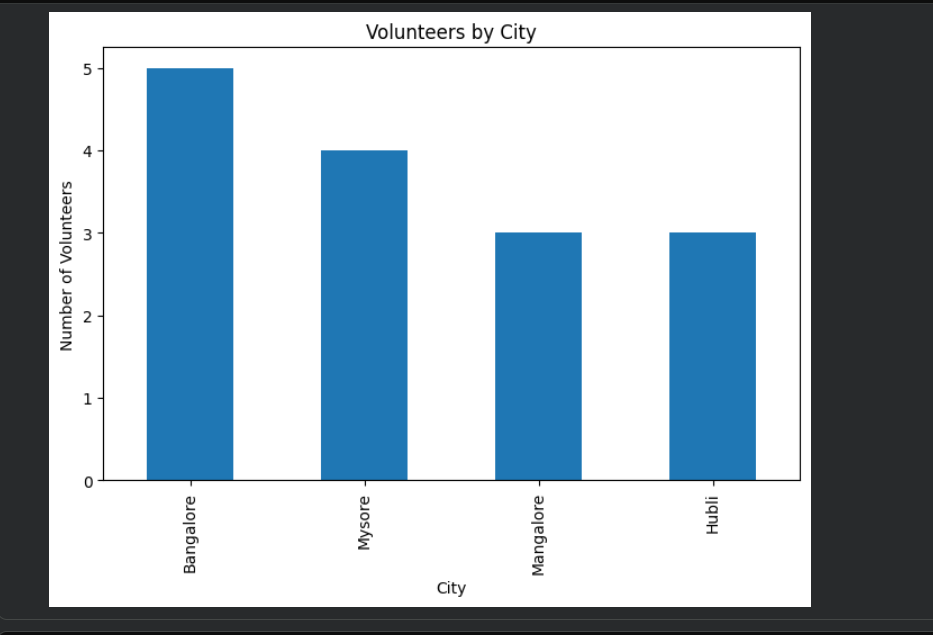

# 🕊️ NayePankh Foundation — Volunteer Skill Matching & Recommendation System

<div align="center">

### Empowering NGOs Through Data-Driven Volunteer Allocation

A Python-based volunteer management and recommendation system designed to help NayePankh Foundation efficiently match volunteers with suitable activities based on their skills and interests.

</div>

---

## 📌 Overview

Volunteer management is one of the most important aspects of any NGO. Assigning the right volunteers to the right activities can significantly improve engagement, efficiency, and impact.

The **NayePankh Volunteer Skill Matching & Recommendation System** is a Python-based project that analyzes volunteer skills and automatically recommends suitable NGO activities. The system also generates compatibility scores, provides analytics, supports volunteer search and filtering, and creates visual reports to assist decision-making.

---

## 🎯 Project Objective

The objective of this project is to help NayePankh Foundation:

* Identify volunteer strengths and expertise
* Recommend suitable activities based on skills
* Improve volunteer allocation and engagement
* Generate meaningful insights from volunteer data
* Support data-driven decision-making

---

## ✨ Features

### 👥 Volunteer Database

Store and manage volunteer information including:

* Name
* City
* Skills
* Recommended Activity
* Match Score

---

### 🎯 Smart Recommendation Engine

The system automatically analyzes volunteer skills and recommends suitable NGO activities.

| Skills                       | Recommended Activity |
| ---------------------------- | -------------------- |
| Python, AI, Machine Learning | Technical Mentorship |
| Teaching, Communication      | Education Program    |
| Canva, Design                | Awareness Campaign   |
| Social Media, Marketing      | Outreach Campaign    |
| Event Management             | Volunteer Events     |

---

### 📊 Match Score Generation

Generate compatibility scores for volunteers based on their skill sets.

Example:

```text
Volunteer: Rahul

Skills:
Python, AI

Recommended Activity:
Technical Mentorship

Match Score:
95%
```

---

### 🔍 Volunteer Search

Search volunteers by name and quickly retrieve matching records.

Example:

```text
Enter Volunteer Name: Priya
```

---

### 🏷️ Skill-Based Filtering

Filter volunteers according to specific skills.

Example:

```text
Enter Skill: Python
```

---

### 🌍 City-Based Filtering

Filter volunteers by city to identify location-specific volunteer pools.

Example:

```text
Enter City: Bangalore
```

---

### 🏆 Volunteer Ranking

Identify top volunteers based on compatibility scores and recommended activities.

---

### 📈 Analytics Dashboard

Generate valuable volunteer insights including:

* Total Volunteers
* Volunteers by City
* Recommended Activities Distribution
* Average Match Score

---

### 📉 Data Visualization

Visualize volunteer trends using charts generated with Matplotlib:

* Activity Distribution Chart
* City Distribution Chart

---

### 📄 CSV Report Export

Export processed volunteer data into CSV format for future reporting and analysis.

Generated File:

```text
NayePankh_Volunteer_Report.csv
```

---

## 🖼️ Project Screenshots

### Volunteer Dataset



### Recommendation Results



### Search Functionality



### Skill Filtering



### Analytics Dashboard



### Activity Distribution Chart



### City Distribution Chart



---

## 🧠 How the Recommendation Engine Works

```text
Volunteer Skills
        │
        ▼
 Skill Analysis
        │
        ▼
 Activity Recommendation
        │
        ▼
 Match Score Generation
        │
        ▼
 Analytics & Reporting
```

### Example

```text
Skills:
Python, AI

Recommended Activity:
Technical Mentorship

Match Score:
95%
```

The recommendation engine evaluates volunteer skills and maps them to the most suitable NGO activities while generating a compatibility score.

---

## 🛠️ Technologies Used

| Technology   | Purpose                      |
| ------------ | ---------------------------- |
| Python       | Core Programming             |
| Pandas       | Data Processing and Analysis |
| Matplotlib   | Data Visualization           |
| Google Colab | Development Environment      |
| CSV          | Data Export and Reporting    |

---

## 📁 Project Structure

```text
NayePankh-Volunteer-Skill-Matching-System
│
├── README.md
├── NayePankh_Volunteer_Skill_Matcher.ipynb
├── NayePankh_Volunteer_Report.csv
│
└── screenshots
    ├── dataset.png
    ├── recommendations.png
    ├── search.png
    ├── filter.png
    ├── analytics.png
    ├── activity_chart.png
    └── city_chart.png
```

---

## 🚀 Project Workflow

```text
Volunteer Data
      │
      ▼
Skill Analysis
      │
      ▼
Activity Recommendation
      │
      ▼
Match Score Calculation
      │
      ▼
Search & Filtering
      │
      ▼
Analytics Generation
      │
      ▼
Data Visualization
      │
      ▼
CSV Report Export
```

---

## 📊 Key Insights Generated

The system can provide:

* Volunteer distribution by city
* Activity recommendation trends
* Volunteer compatibility scores
* Top recommended volunteers
* Overall volunteer statistics

These insights can help NGOs improve volunteer engagement and resource allocation.

---

## 🌟 Impact

This project demonstrates how simple data-driven solutions can improve NGO operations by:

* Matching volunteers with suitable activities
* Supporting efficient volunteer allocation
* Improving engagement and participation
* Providing analytical insights
* Enhancing organizational decision-making

---

## 👩‍💻 Internship Submission

**Python Development Internship Task**

**Organization:** NayePankh Foundation

---

## 🙏 Acknowledgement

This project was developed as part of the internship selection process for NayePankh Foundation to demonstrate Python programming, data analysis, recommendation systems, and volunteer management concepts.

---

<div align="center">

### Built with Python for Social Impact ❤️

Helping NGOs connect the right volunteers with the right opportunities.

</div>
